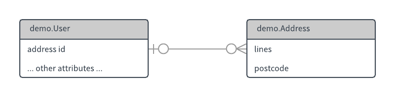
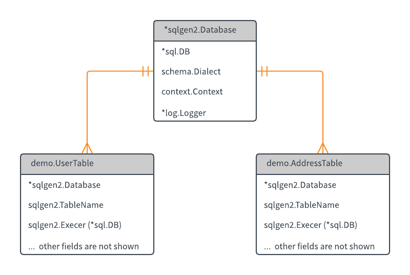

# Using sqlgen2

*sqlgen* is *not* an ORM: it does not automatically handle 'object' - relational mapping. It's simpler - but just as comprehensive.

You are expected to understand your own database; *sqlgen* removes the hard work of reliably writing the necessary `database/sql` API calls.

*sqlgen* gives you a table-focussed view of your database. The principal concept is a simple one.

 * You write a `struct` for every database table you want to manage.
 * If necessary, you also write a `struct` for every view or join result.

Then, *sqlgen* generates code that maps these onto the corresponding database tables.

Consider these two structs, both of which are in the [demo](https://github.com/rickb777/sqlgen2/tree/master/demo) package.

```Go
type User struct {
    Uid          int64
    Name         string
    EmailAddress string
    AddressId    *int64
    // ... other fields not showm
}

type Address struct {
    Id       int64
    Lines    []string
    Postcode string
}
```

These represent tables that have a one-to-many relationship. By the way, notice how `User.AddressId` is a pointer - as a convention, we use pointers for optional items.



We can run the following commands:

```
sqlgen -type demo.User user.go
sqlgen -type demo.Address address.go
```

The tool generates code that includes `user_sql.go`:

```Go
type UserTable struct {
    // contains filtered or unexported fields
}

// NewUserTable returns a new table instance.
// If a blank table name is supplied, the default name "users" will be used instead.
// The request context is initialised with the background.
func NewUserTable(name sqlgen2.TableName, d *sqlgen2.Database) DbUserTable {
	// ... etc
}
```

and `address_sql.go`:

```Go
type AddressTable struct {
    // contains filtered or unexported fields
}

// NewAddressTable returns a new table instance.
// If a blank table name is supplied, the default name "users" will be used instead.
// The request context is initialised with the background.
func NewAddressTable(name sqlgen2.TableName, d *sqlgen2.Database) DbUserTable {
	// ... etc
}
```

These table structs are types that have many methods for accessing the database table. You have some control over what methods are included or not, and this will be described further later on. For example, you might not need update methods on a log table.

The two generated structs are related to a provided type called `Database`.



You normally have exactly one [`*Database`](https://godoc.org/github.com/rickb777/sqlgen2#Database) in your app: it wraps the `*sql.DB` connection and logger (if you need one).

## Controlling What the Columns Mean

This is a great start, but what if we want to specify primary keys, column sizes and more? This may be achieved by annotating your code using Go tags. For example, we can tag the `ID` field to indicate it is a primary key and will auto increment:

```diff
type User struct {
-   Uid     int64
+   Uid     int64  `sql:"pk: true, auto: true"`
    Name    string
    Email   string
}
```

This information allows the tool to generate smarter SQL statements:

```diff
CREATE TABLE IF NOT EXISTS users (
-user_id     INTEGER
+user_id     INTEGER PRIMARY KEY AUTOINCREMENT
,user_login  TEXT
,user_email  TEXT
);
```

Including SQL statements to select, insert, update and delete data using the primary key:

```Go
const SelectUserPkeyStmt = `
SELECT 
 id,
 login,
 email
WHERE user_id=?
`

const UpdateUserPkeyStmt = `
UPDATE users SET 
 id=?,
 login=?,
 email=?
WHERE user_id=?
`

const DeleteUserPkeyStmt = `
DELETE FROM users 
WHERE user_id=?
`
```

We can take this one step further and annotate indexes. In our example, we probably want to make sure the `user_login` field has a unique index:

```diff
type User struct {
    Uid     int64  `sql:"pk: true, auto: true"`
-   Name    string
+   Name    string `sql:"unique: login"`
    Email   string
}
```

This information instructs the tool to generate the following:


```Go
const CreateUserName  = `
CREATE UNIQUE INDEX IF NOT EXISTS user_login ON users (user_login)
```

## Tags Summary

The important tags are:

| Tag      | Value         | Purpose                                                      |
| -------- | ------------- | ------------------------------------------------------------ |
| pk       | true or false | the column is the primary key                                |
| auto     | true or false | the column is auto-incrementing (applies to MySQL only)      |
| name     | string        | the column name                                              |
| type     | string        | overrides the column type explicitly                         |
| size     | integer       | sets the storage size for the column                         |
| index    | string        | the column has an index                                      |
| unique   | string        | the column has a unique index                                |

See [**full details of tags**](tags.md).


## Nesting

Nested Go structures will normally be flattened into a single database table. As an example, we have a `User` and `Address` with a one-to-one relationship. In some cases, we may prefer to de-normalize our data and store in a single table, avoiding un-necessary joins.

```diff
type User struct {
    Uid    int64  `sql:"pk: true"`
    Name   string
    Email  string
+   Addr   *Address
}

type Address struct {
    City   string
    State  string
    Zip    string `sql:"index: user_zip"`
}
```

The above relationship is flattened into a single table (see below). When the data is retrieved from the database the nested structure is restored.

```sql
CREATE TALBE IF NOT EXISTS users (
 id         INTEGER PRIMARY KEY AUTO_INCREMENT,
 login      TEXT,
 email      TEXT,
 addr_city  TEXT,
 addr_state TEXT,
 addr_zip   TEXT
);
```

### Conflicting Tags in Shared Nested Structs

If you want to nest a struct into several types that you want to process with *sqlgen*, you might run up against a challenge: the field tags needed in one case might be inappropriate for another case. In the `Address` example above, we might also nest `Address` into some other structs but not with the same set of tags.

There's an easy way around this issue: you can supply a Yaml file that sets the tags needed in each case. The Yaml file has tags that override the tags in the Go source code.

If you prefer, you can even use this approach for all tags; this means you don't need *any* tags in the Go source code.

This example has two fields with tags.

```go
type User struct {
    Uid uint64 `sql:"pk: true, auto: true"`
    Name       `sql:"name: username"`
}
```

The Yaml below overrides the tags. When used, the effect is that the `Uid` field would be neither primary key nor auto-incrementing. The `Name` field would have size 50 instead of the default (255), but the `name: username` setting would be kept.

```yaml
Uid:
  pk:   false
  auto: false
Name:
  size: 50
```

### Dialects

The generated code supports the following SQL dialects: `postgres`, `mysql` and `sqlite`. You decide at runtime which you need to use.


### Indexes

If your columns need indexes, `sqlgen` includes extra code for CRUD operations based on the indexed columns as well as on the primary key. This example shows a primary key column `Id`, an indexed column `Name `, and a uniquely indexed column `EmailAddress`.

```Go
type User struct {
	Uid          int64    `sql:"pk: true, auto: true"`
	Name         string   `sql:"index: user_name"`
	EmailAddress string   `sql:"unique: user_email"`
	AddressId    *int64   `sql:"fk: addresses.id, onupdate: restrict, ondelete: restrict"`
    // ... other fields not showm
}
```

[List of all the tags](tags.md).


## Joins and Views

Writing join queries is easy if you already know how to write the SQL. Sqlgen2 doesn't do this for you, but provides a `Query` method to do the heavy lifting.

All you need to write is a view type that is a Go struct to match the columns returned from the join. I like to name these something like `FirstSecondJoin`, referring to the first and second table types (and more if needed).

Because the only use-case is via the `Query` method, don't enable any of the command-line `-select`, `-update` etc flags. You won't need `schema` either.

You will probably find it helpful to use `-kind View`, which will cause your generated code to be `FirstSecondJoinView` (instead of `FirstSecondJoinTable`).  


## The API

Package `github.com/rickb777/sqlgen2/require` provides:

 * requirements that specify the expected size of the result set, or the number of rows affected, as appropriate.  

Package `github.com/rickb777/sqlgen2/where` provides:

 * a builder API for 'where' clauses
 * query constraints  

See [**api**](api.md) for details of these and of the methodss generated for the table types.


## Go Generate

Example use with `go:generate`:

```Go
package demo

//go:generate sqlgen -type demo.User -gofmt -all -setters=all user.go role.go

type User struct {
    Uid    int64  `sql:"pk: true, auto: true"`
    Name   string `sql:"unique: user_login"`
    Email  string `sql:"size: 1024"`
    Avatar string
}
```

See the [command line options](usage.md).


## Restrictions

 * Compound primary keys are not supported.
 * Compound foreign keys are not supported.
 * In the structs used for tables, the imports must not use '.' or be renamed.

